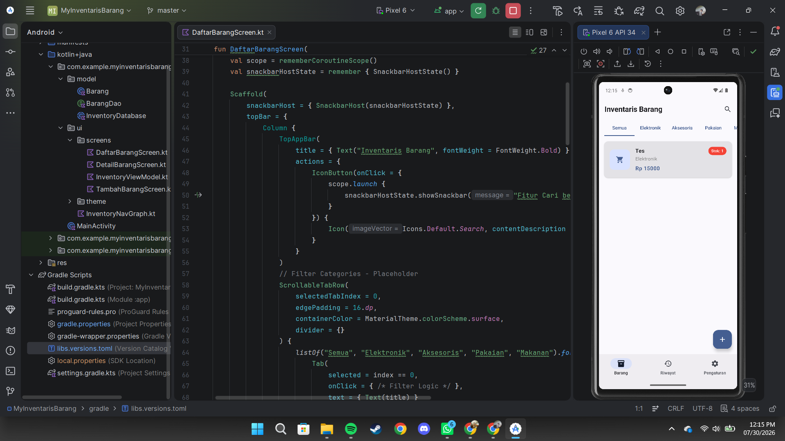

# MyInventarisBarang

A simple Android application to manage inventory items, built with modern Android development practices.

## Main Features

1.  **Daftar Barang (Item List)**: Displays a collection of inventory items in a `LazyColumn`. Each item card shows an icon, name, category, price, and a stock badge (color-coded based on availability).
2.  **Detail Item**: Provides a comprehensive view of a selected item, including a large image placeholder, detailed technical specs (SKU, weight, status), and a full description.
3.  **Tambah Barang (Add Item)**: A complete form to add new inventory, featuring image upload simulation, category selection via dropdown, side-by-side fields for numerical data, and a multi-line description area.
4.  **Navigation**: Seamless transitions between screens using Jetpack Navigation Compose.

## Project Structure

-   `model/` : Contains the `Barang` data class.
-   `ui/screens/` :
    -   `DaftarBarangScreen.kt` : The main dashboard for viewing items.
    -   `DetailBarangScreen.kt` : Screen for viewing specific item details.
    -   `TambahBarangScreen.kt` : Form for adding new items.
-   `MainActivity.kt` : Entry point and navigation host configuration.
-   `ui/theme/` : Standard Compose theme configuration.

## Preview

## Technology Stack

-   **Language**: Kotlin
-   **UI Framework**: Jetpack Compose (Material 3)
-   **Navigation**: Navigation Compose
-   **Icons**: Material Icons Extended
-   **Build Tool**: Gradle (Kotlin DSL)
-   **Architecture**: State-hoisting and standard modern Android patterns.

## Recent Improvements

-   Implemented `Snackbar` notifications for buttons with pending functionality (Search, Bottom Navigation items, Edit/Delete, and Image Upload).
-   Updated project to `compileSdk` and `targetSdk` 37 for compatibility with the latest Android libraries.
